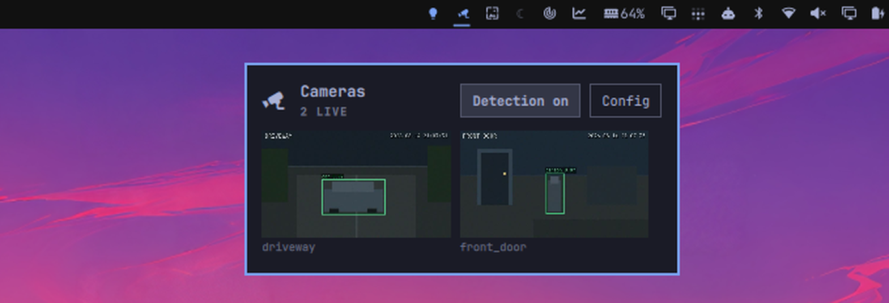

# Cameras for Omarchy

Watch your cameras without leaving the Omarchy bar. The plugin shows a grid of
live thumbnails, opens any camera full size in mpv, and pops up a preview the
moment Frigate detects something. Cameras come from Frigate, from ONVIF
discovery on the local network, or from both.



## Install

```bash
omarchy plugin add \
  https://github.com/chameleonbr/omarchy_cameras.git \
  --enable \
  --yes
```

The widget starts on the right side of the bar and can be moved with Omarchy's
bar customization controls. Restart the shell once after installing:

```bash
omarchy restart shell
```

The plugin calls `curl`, `mpv`, `jq`, `secret-tool` and `python3`. Omarchy
ships all but `curl` and `python3`, which normally arrive as dependencies of
something else:

```bash
sudo pacman -S --needed curl python jq mpv libsecret
```

Anything missing is named at the top of **Config** rather than failing quietly.

## Set up

Select the bar icon, then **Config**. Switch on the sources you have — each
one's settings appear only once it is on, so an ONVIF-only setup never has to
read about restreams.

**Frigate.** Enter the server URL. Everything else is read from Frigate itself:
the camera list, the go2rtc restream port, and the MQTT broker. Fill in a login
only if your Frigate asks for one.

**ONVIF cameras.** Fill in the camera login, then either **Search the network**
or type an address under **Add one by address**. Adding a camera reads its RTSP
URL over ONVIF, so the address never has to be typed by hand. The login is
stored per camera, so cameras with different credentials are added one at a
time.

Passwords go to the system keyring, never to the config file.

## Use

- Select any tile to open that camera in mpv. Press `f` there for fullscreen,
  `q` to close.
- Select **Detection on/off** to arm or disarm motion alerts. While armed the
  bar icon takes the theme's accent color.
- Middle-click the bar icon to arm or disarm without opening anything.
- Right-click the bar icon to refresh.

| Key     | Action                   |
| ------- | ------------------------ |
| arrows  | move between cameras     |
| `Enter` | open the selected camera |
| `R`     | refresh                  |
| `C`     | show or hide Config      |
| `Esc`   | close                    |

For a keybinding, `omarchy-shell shell toggle avila.cameras '{}'` opens the
grid on the focused monitor, and `omarchy-shell avila.cameras view <name>`
jumps straight to one camera.

## Motion alerts

Off by default. Once armed, a small preview of whichever camera tripped appears
for a few seconds and then goes away; selecting it opens that camera full size.
Several detections stack, oldest on top.

The preview is the still Frigate saved for the event, with its bounding box and
label drawn on. Alerts fire while the detection is still happening rather than
after it ends, so the preview arrives in seconds instead of after the subject
has left.

**Config → Motion alerts** sets which labels count, which monitor, which
corner, how long it stays and how wide it is. Changing the monitor, corner or
width rehearses the placement, so you can see the spot without waiting for
something to walk past a camera.

**Config → MQTT** is optional and only makes alerts faster: Frigate publishes a
detection the instant it makes one. Measured against a live camera, 0.6-0.7s
instead of 3.9-9.1s. Only the broker password is needed — everything else comes
from Frigate. HTTP polling keeps running whenever the broker is not connected,
so a wrong password costs latency, not alerts.

## Remove

```bash
omarchy plugin remove avila.cameras --yes
```

Settings and stored passwords are left behind. To remove those too:

```bash
rm -f ~/.config/omarchy/cameras.json
rm -f ~/.local/state/omarchy/cameras-last-event
secret-tool clear service omarchy-cameras
```

Removing the plugin never touches Frigate or the cameras themselves.

## Configuration file

`~/.config/omarchy/cameras.json` holds everything the config screen writes. It
is watched, so hand edits apply without a restart.

```json
{
  "sources": { "frigate": true, "onvif": false },
  "frigate": { "url": "http://nvr.lan:5000", "rtspPort": 8554, "user": "" },
  "alerts": {
    "enabled": false,
    "labels": ["person"],
    "monitor": "",
    "position": "top-center",
    "durationSec": 12,
    "width": 320,
    "useMqtt": false
  },
  "onvif": []
}
```

`frigate.rtspPort` is only a fallback: the real port is read out of Frigate's
own camera inputs. `alerts.monitor` is a connector name as the compositor
reports it (`DP-1`, `HDMI-A-1`); empty means the first screen. `onvif[]` is
written by the config screen, but hand-editing is fine —
`{"name": …, "rtsp": …, "user": …, "ptz": true|false, "xaddr": …}`.

Grid columns and thumbnail refresh live on the bar widget entry in
`~/.config/omarchy/shell.json`, or in Setup > Plugins.

## How it works

Wayland has no window embedding, so either the pixels are produced inside the
`omarchy-shell` process or the video is a separate window. The plugin uses each
where it fits: thumbnails are JPEGs refreshed inside the shell, and the focused
view is a floating mpv window. Nobody watches nine streams at once, and
decoding nine of them to fill 170px tiles would spend a lot of CPU on pictures
too small to read.

Frigate cameras play the go2rtc restream where one exists and Frigate's MJPEG
endpoint otherwise, because asking for a restream that is not there just yields
a dead window. ONVIF cameras play their own RTSP stream, and their thumbnails
come from one mpv per visible camera, held open and asked for a frame on a
timer: ONVIF does define a snapshot endpoint, but cameras that advertise one
and then refuse every request are common enough that it cannot be relied on.

Searching for ONVIF cameras probes every address on the local subnet as well as
the multicast group. The multicast reply arrives with no matching outbound
flow, so a default-deny firewall drops it and many Wi-Fi access points never
forward it between clients; a direct probe is an ordinary tracked exchange.

## Development

`omarchy plugin add` clones from git, which is awkward while working on the
plugin. Symlink the checkout instead:

```bash
ln -s ~/src/omarchy_cameras ~/.config/omarchy/plugins/avila.cameras
omarchy plugin validate ~/src/omarchy_cameras
omarchy-shell shell rescanPlugins
omarchy plugin enable avila.cameras
```

Editing QML does not update the running widget, symlinked or not. Run
`omarchy restart shell` after each change.

```bash
node test_cameras.js   # camera lists, stream selection, event filtering
python3 test_mqtt.py   # MQTT packet framing and event payloads
python3 test_onvif.py  # WS-Security digest, SOAP parsing, credentials
python3 test_thumbd.py # runtime directory ownership and symlink checks
```

`omarchy-shell avila.cameras status` reports what the plugin currently sees;
`mqtt ""` and `discovery` do the same for the broker and the last search.

## Security and license

Passwords are never written to `cameras.json`. Frigate, MQTT and per-camera
ONVIF passwords go to the system keyring under `service=omarchy-cameras`, and
reach the helper scripts over stdin rather than argv, which any process on the
machine can read.

A camera URL carries its password in the userinfo, so it is never an argument
either: mpv is handed the URL as a playlist on an anonymous pipe, both for the
viewer and for thumbnails, and the list of cameras to watch also arrives on
stdin. Nothing about a camera shows up in `/proc`.

Thumbnails and cookies are written under `$XDG_RUNTIME_DIR`, which is per-user
and 0700. There is no fallback to `/tmp`: the helpers refuse to run rather than
put camera frames on a predictable path in a world-writable directory, and the
subdirectory is checked for ownership, mode, and not being a symlink before
anything is written to it.

MIT licensed.
